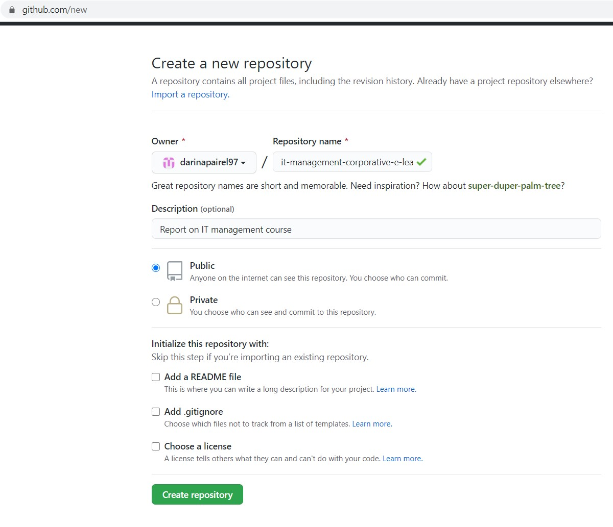
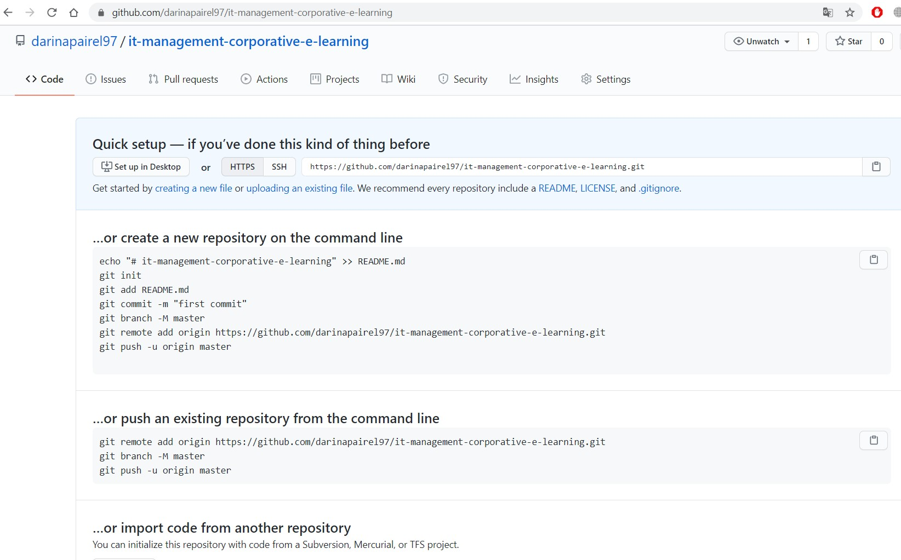
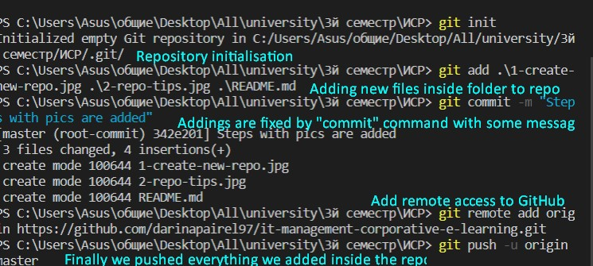
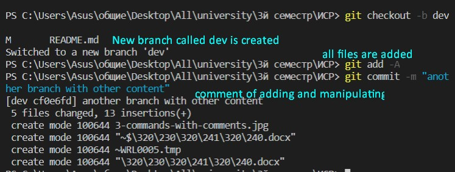
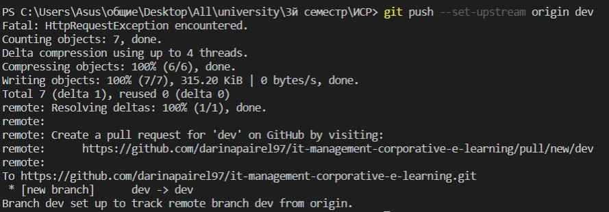
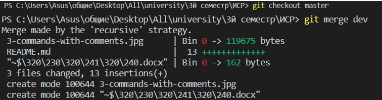

# Invariative task IT management
## This is a report for *IT management course*
### First task with git
There are pics to show the flow of the task:
creating a repo in GitHub

Tips for next steps

Using git commands for manipulating with repo and content

Commenting new "dev" branch addition

Pushing (loading) files on GitHub

Merge of two branches

