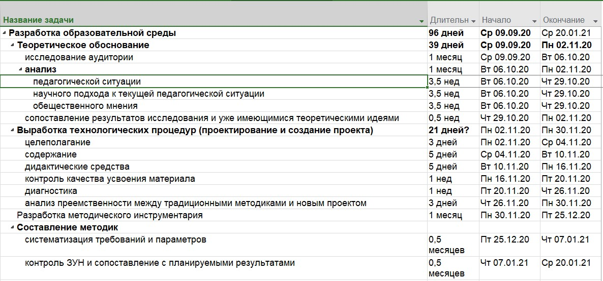
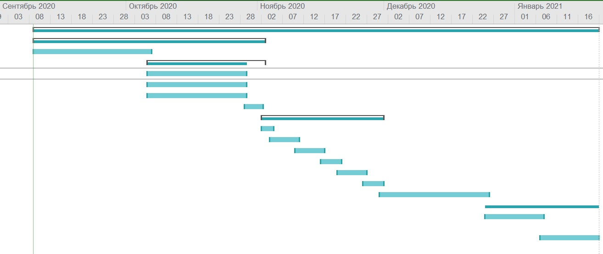

# Invariative task IT management
## This is a report for *IT management course*
### Second task with Gant chart

1. First of all, we should define steps for education projection:

    1. **Теоретическое обоснование**
        1. исследование аудитории
        2. анализ:
            1. педагогической ситуации
            2. научного подхода к текущей педагогической ситуации
            3. научного подхода к текущей педагогической ситуации
        3. сопоставление результатов исследования и уже имеющимися теоретическими идеями
    2. **Выработка технологических процедур (проектирование и создание проекта)**
        1. целеполагание
        2. содержание
        3. дидактические средства
        4. контроль качества усвоения материала
        5. диагностика
        6. анализ преемственности между традиционными методиками и новым проектом
    3. **Разработка методического инструментария**
    4. **Составление методик** 
        1. систематизация требований и параметров
        2. контроль ЗУН и сопоставление с планируемыми результатами

2. Then we should define duration for each step:

3. After creating table in MS Project we get Gant diagramm:

#### used literature
1. https://lrn.no-ip.info/other/books/Book-Microsoft-Project_cleaned_html_in_pdf.pdf
2. https://e.lanbook.com/reader/book/40034/
3. https://e.lanbook.com/reader/book/66093/
4. https://cyberleninka.ru/article/n/sozdanie-razvivayuschey-obrazovatelnoy-sredy-kak-aktualnoe-i-perspektivnoe-napravlenie-professionalnoy-deyatelnosti-uchiteley/viewer
