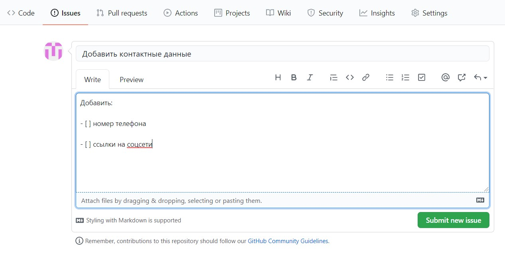

# Изучив конкретную систему управления IT-проектами корпоративного обучения, использовав одну из стратегий ветвления (branching strategies) на основе сервиса GitHub реализовать добавление функции в существующем программном IT-проекте веб-ориентированной компоненте образовательной среды, предварительно создать запрос на добавление функционала (issue), спланировать временные затраты. 

1. Допустим, у нас есть репозиторий в СКВ git (GitHub):

2. Создадим запрос на изменение некоторых "features" проекта перейдя на вкладку Issues:

3. и заполнив форму:

4. Затем ответим на этот вопрос, создав pull request:

![new pull request][5.jpg]

5. Итого, мы имеем предложение на решение вопроса и можем принять уже готовое дополнение для нашего проекта.

